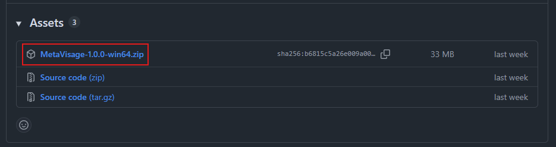
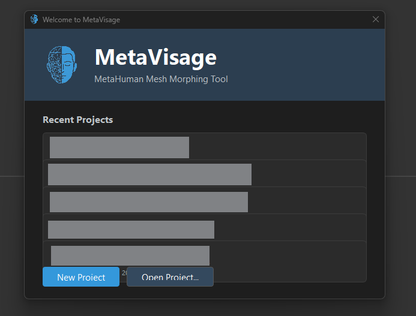
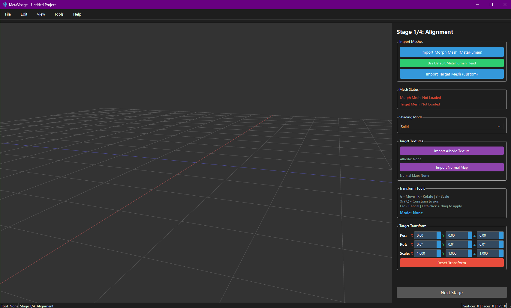

import { Steps, Aside, LinkCard } from '@astrojs/starlight/components';

**This guide walks you through downloading and installing MetaVisage on your Windows computer.** By the end, you'll have MetaVisage running and ready to transform your first character mesh.

## What You'll Achieve

After completing this guide, you will have:
- MetaVisage installed on your Windows system
- The application launched and ready to use
- Verified that your installation is working correctly

**Time required:** Approximately 5 minutes.

## Prerequisites

Before you begin, make sure you have:

- [x] **Windows 10 or later** - MetaVisage is compatible with Windows 10, Windows 11, and newer versions
- [x] **Internet connection** - To download the application from GitHub
- [x] **At least 500 MB of free disk space** - For the application files and workspace
- [x] **Ability to extract .zip files** - Built into Windows 10+ (right-click → Extract All)

<Aside type="note">
**macOS or Linux users:** MetaVisage currently provides official releases for Windows only. If you're interested in builds for other platforms, check the [GitHub repository](https://github.com/cmershon2/MetaVisage) for community contributions or build instructions.
</Aside>

## Installation Steps

<Steps>

1. **Download the latest release**

   Go to the MetaVisage releases page on GitHub:  
   [https://github.com/cmershon2/MetaVisage/releases](https://github.com/cmershon2/MetaVisage/releases)

   

   Look for the **Latest** release tag at the top of the page. Under the **Assets** section, download the Windows version - it will be named something like:
   - `MetaVisage-v1.0.0-win64.zip`

   **What you should see:** The .zip file downloads to your default Downloads folder.

2. **Extract the application files**

   1. Navigate to your Downloads folder and locate the `MetaVisage-vX.X.X-win64.zip` file
   2. Right-click the .zip file and select **Extract All...**
   3. Choose a location to extract the files - we recommend:
      - `C:\MetaVisage` (easy to find and remember)
      - Or your Desktop (for quick access during testing)
      - Or any folder you prefer
   4. Click **Extract**
   5. Open the extracted folder
   6. Look for `MetaVisage.exe` - this is the application executable

   **What you should see:** A folder containing the MetaVisage application files, including `MetaVisage.exe` and supporting libraries.

   <Aside type="tip">
   **Create a shortcut for easy access:** Right-click on `MetaVisage.exe`, select **Send to → Desktop (create shortcut)**. This gives you quick access without navigating to the folder each time. You can also drag the .exe to your taskbar to pin it.
   </Aside>

3. **Launch MetaVisage for the first time**

   1. Navigate to the folder where you extracted the files
   2. Double-click `MetaVisage.exe` to launch the application

   

   **What you should see:** MetaVisage's main window opens, showing a welcome screen. The interface displays the main toolbar, viewport panel, and controls panel.

   <Aside type="tip">
   **First launch may take a few extra seconds** while MetaVisage initializes its configuration files and sets up your workspace. This is normal - subsequent launches will be faster.
   </Aside>

4. **Verify the installation**

   To confirm everything is working correctly:
   
   1. Look at the window title bar - it should display "MetaVisage" and the version number (e.g., "MetaVisage v1.0.0")
   2. Check that the main viewport is visible and responsive
   3. Try clicking on the **File** menu - you should see options like **Import Mesh**, **Export**, and **Settings**

   **What you should see:** A responsive interface with all menus and panels accessible. If you can see the File menu and interact with the viewport, your installation is successful.

</Steps>

## Expected Result

After completing these steps, you should have:

✓ **MetaVisage extracted** to a folder on your Windows system  
✓ **The application launched** and displaying the main interface  
✓ **A working installation** verified through the interface check  
✓ **Access to all menus and tools** ready for your first character fit

<Aside type="tip">
**Optional: Create a shortcut** - If you haven't already, right-click on `MetaVisage.exe` and select **Send to → Desktop (create shortcut)** for quick access. You can also pin it to your taskbar by dragging the .exe to the taskbar.
</Aside>

## Next Steps

Now that MetaVisage is installed, you're ready to fit your first character:

<LinkCard
  title="Your First Fit"
  description="Walk through the complete fitting process with a sample character mesh. See results in under 10 minutes."
  href="/guides/first-fit"
/>

<LinkCard
  title="Preparing Your Mesh"
  description="Learn what makes a 'good' source mesh and how to prepare your character for the best results."
  href="/guides/mesh-preparation"
/>

## Troubleshooting

### Problem: Windows blocks MetaVisage with a SmartScreen warning when I try to run it

**Likely Cause:** Windows SmartScreen doesn't recognize the publisher because MetaVisage is not commercially signed.

**Solution:**
1. When you see "Windows protected your PC," click **More info**
2. Click **Run anyway** to launch MetaVisage
3. Alternatively, verify the file hash matches the one on GitHub before running

<Aside type="note">
You can verify the application's integrity by comparing its SHA-256 hash against the one published on the GitHub releases page. Use PowerShell: `Get-FileHash MetaVisage.exe -Algorithm SHA256`
</Aside>

---

### Problem: MetaVisage crashes immediately when I try to launch it

**Likely Cause:** Missing system dependencies, outdated graphics drivers, or conflicting software.

**Solution:**
1. Make sure your graphics drivers are up to date:
   - For NVIDIA: Visit [nvidia.com/drivers](https://www.nvidia.com/drivers)
   - For AMD: Visit [amd.com/support](https://www.amd.com/support)
   - For Intel: Use Windows Update or visit [intel.com/support](https://www.intel.com/support)
2. Install the latest [Microsoft Visual C++ Redistributable](https://learn.microsoft.com/en-us/cpp/windows/latest-supported-vc-redist) if prompted
3. Try running MetaVisage as Administrator (right-click `MetaVisage.exe` → Run as administrator)
4. Check the Windows Event Viewer for error details (Windows → Event Viewer → Windows Logs → Application)

---

### Problem: I extracted the files but can't find MetaVisage.exe

**Likely Cause:** The files were extracted to an unexpected location, or you're looking in the wrong folder.

**Solution:**
1. Check your Downloads folder for the extracted `MetaVisage` folder
2. Use Windows Search to find "MetaVisage.exe" on your computer
3. If you can't find it, extract the .zip file again and pay attention to the destination folder path

---

### Problem: Antivirus software quarantines or blocks MetaVisage.exe

**Likely Cause:** False positive detection because MetaVisage is unsigned open-source software.

**Solution:**
1. Add MetaVisage.exe and its folder to your antivirus software's exception list
2. Temporarily disable your antivirus while extracting and running for the first time (not recommended unless you've verified the file hash)
3. Extract the .zip file again - sometimes partial extractions trigger false positives
4. Verify the file hash against the GitHub releases page to confirm authenticity

---

### Problem: When I double-click MetaVisage.exe, nothing happens

**Likely Cause:** Windows is blocking the executable, or required dependencies are missing.

**Solution:**
1. Right-click `MetaVisage.exe` and check **Properties** → **General** tab
2. If you see "This file came from another computer and might be blocked," click **Unblock** and then **Apply**
3. Try running MetaVisage.exe again
4. If it still doesn't launch, check the Event Viewer for error messages

---

## Still Having Issues?

If you're experiencing problems not covered here:

1. **Check the GitHub Issues page:** [github.com/cmershon2/MetaVisage/issues](https://github.com/cmershon2/MetaVisage/issues)  
   Search for your specific error or symptom - someone may have already found a solution.

2. **Post a new issue:** If you can't find an answer, create a new issue with:
   - Your Windows version
   - The MetaVisage version you downloaded
   - The exact error message or behavior you're seeing
   - Screenshots if applicable
---

**Installation successful?** Great! Let's move on to [Your First Fit](/guides/first-fit) and transform a character mesh.