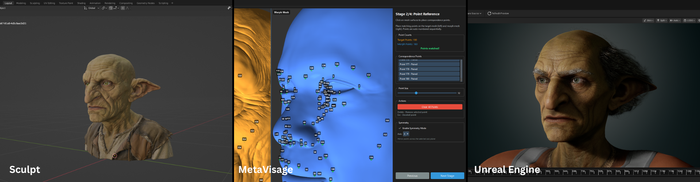

import { Card, CardGrid, Aside, LinkCard } from '@astrojs/starlight/components';

**MetaVisage is a free, open-source desktop application that bridges the gap between your custom character sculpts and Epic's MetaHuman system.** If you've ever wanted to use your own character designs with the MetaHuman rig, facial animations, and ecosystem, without manually retopologizing or rigging, MetaVisage makes it possible.

## What MetaVisage Does

MetaVisage takes two inputs:
1. **Your custom character mesh** - the unique 3D character you've sculpted, modeled, or AI generated
2. **A MetaHuman base mesh** - Epic's high-quality, production-ready character model

Then it automatically fits the MetaHuman onto your custom mesh, creating a new character that combines:
- **Your original design** - the distinctive look and proportions of your character
- **MetaHuman's technical foundation** - the topology, UVs, and rig that make facial animation and Unreal Engine integration seamless

Think of it like shrink-wrapping: MetaVisage progressively pulls the MetaHuman's surface onto your mesh until the two align as closely as possible. The result is a character that looks like yours but works like a MetaHuman.

---

## Who MetaVisage Is For

<CardGrid>
  <Card title="Character Artists" icon="pencil">
    Create unique characters without sacrificing the power of the MetaHuman ecosystem. Focus on design, not technical rigging.
  </Card>
  
  <Card title="Game Developers" icon="seti:config">
    Rapidly prototype diverse character rosters using your own art style while maintaining consistent technical quality.
  </Card>
  
  <Card title="Animation Studios" icon="seti:video">
    Convert concept sculpts into animation-ready assets that work with your existing MetaHuman pipeline.
  </Card>
  
  <Card title="Students & Hobbyists" icon="open-book">
    Learn character workflows without getting blocked by complex rigging and topology requirements.
  </Card>
</CardGrid>

---

## What You'll Be Able to Do

After using MetaVisage, you'll have a character mesh that:

- ✓ **Maintains your artistic vision** - Your character's unique facial features, proportions, and style are preserved
- ✓ **Works in Unreal Engine** - Drop it directly into your UE5 project with MetaHuman compatibility
- ✓ **Supports facial animation** - All MetaHuman facial controls and blendshapes work immediately
- ✓ **Includes proper topology** - Clean, production-ready mesh structure for deformation and rendering
- ✓ **Has correct UVs** - Texture coordinates that work with MetaHuman's texturing system

## When to Use MetaVisage

**MetaVisage is perfect for:**
- Converting sculpted characters (from ZBrush, Blender, Maya, etc.) into MetaHuman-compatible meshes
- Creating stylized or non-realistic characters that still need professional rigging
- Building character variations that go beyond what MetaHuman Creator offers
- Retrofitting existing character designs into your MetaHuman pipeline

**MetaVisage might not be the best choice when:**
- You need pixel-perfect control over every vertex position - the fitting process is automated, not manual
- Your character's proportions are extremely different from human anatomy (very exaggerated cartoon styles, creatures, etc.)
- You're working with characters that have drastically different topology (extra facial features, missing parts, etc.)

## How MetaVisage Works (The Simple Version)

You don't need to understand the technical details to use MetaVisage successfully, but here's the basic process:

1. **Import** - You bring in your custom character mesh (as an .obj or similar format)
2. **Align** - You roughly position the MetaHuman to match your character's orientation
3. **Point Reference** - You add points around the key facial elements like eyes, nose, mouth, and ears
4. **Refine** - You adjust parameters if needed to improve the fit quality
5. **Export** - You save the fitted result and bring it into Unreal Engine

Each step takes seconds to minutes, not hours or days. The entire process is designed to feel more like using a filter than building something from scratch.

<Aside type="note">
**Behind the scenes:** MetaVisage uses a fitting algorithm that progressively moves the MetaHuman's vertices closer to your mesh. It's similar to how shrink-wrap modifiers work in 3D software, but optimized specifically for character faces and bodies. You don't need to understand the algorithm - just know that it's doing the heavy lifting for you.
</Aside>

## What You Need to Get Started

Before you dive into MetaVisage, make sure you have:

<CardGrid>
  <Card title="MetaVisage Installed" icon="laptop">
    Download the latest version for your operating system (Windows, macOS, or Linux).
  </Card>
  
  <Card title="A Custom Character Mesh" icon="document">
    An .obj, .fbx, or .stl file of your character. The mesh should have clean, closed geometry - no holes or overlapping faces.
  </Card>
  
  <Card title="Basic 3D Software Knowledge" icon="puzzle">
    Familiarity with concepts like meshes, topology, and importing/exporting 3D files. You don't need to be an expert.
  </Card>
  
  <Card title="Unreal Engine 5 (Optional)" icon="rocket">
    If you want to use your fitted characters in UE5, you'll need Unreal Engine installed with the MetaHuman plugin enabled.
  </Card>
</CardGrid>

## Your Path Forward

Ready to start? Here's the recommended learning path:

<LinkCard
  title="Installation & Setup"
  description="Download MetaVisage and get your workspace ready in under 5 minutes."
  href="/guides/installation"
/>

<LinkCard
  title="Your First Fit"
  description="Walk through the complete process with a sample character mesh. See results in under 10 minutes."
  href="/guides/first-fit"
/>

<LinkCard
  title="Preparing Your Mesh"
  description="Learn what makes a 'good' source mesh and how to clean up common topology issues."
  href="/guides/mesh-preparation"
/>

<LinkCard
  title="Understanding Fit Quality"
  description="Learn how to evaluate your results and adjust parameters to get the best possible fit."
  href="/guides/fit-quality"
/>

## Common Questions

**Q: Will my character look exactly like my original mesh after fitting?**  
A: MetaVisage preserves your character's overall shape, proportions, and distinctive features, but the result is a MetaHuman topology conforming to your surface. Fine details (like specific edge loops or sculpting marks) are captured by the surface fit, not perfectly replicated. Think of it as getting 90–95% visual similarity with 100% technical compatibility.

**Q: Can I use MetaVisage for non-human characters?**  
A: MetaVisage works best with humanoid characters - those with recognizable human facial features and body proportions. Stylized humans (cartoon, anime, etc.) usually work well. Extreme creatures or characters with non-human anatomy may not fit reliably.

**Q: Do I need to know how to rig or create UVs?**  
A: No! That's the whole point. MetaVisage handles the technical requirements automatically. You bring your artistic vision; MetaVisage provides the technical foundation.

**Q: Is this the same as MetaHuman Creator?**  
A: No. Epic's MetaHuman Creator lets you build photorealistic humans by mixing and matching pre-made features. MetaVisage lets you start with *your own* character design and make it MetaHuman-compatible. They're complementary tools serving different creative goals.

**Q: What file formats does MetaVisage support?**  
A: MetaVisage works with common 3D formats including .obj, .fbx, and .stl. Your source mesh should be a clean, closed surface without holes or non-manifold geometry.

## Need Help?

If you get stuck, have questions, or want to share your results:

- **Documentation** - You're already here! Browse the guides and reference sections for detailed help.
- **Community** - Join discussions, see examples, and get troubleshooting help from other MetaVisage users.
- **GitHub Issues** - Report bugs, request features, or contribute to the project directly.

<Aside type="caution">
**Before you start:** MetaVisage is powerful, but it's not magic. The quality of your fitted result depends heavily on the quality of your input mesh. Clean topology, closed geometry, and properly scaled models produce the best results. If you're new to character modeling, we recommend reading the [Mesh Preparation Guide](/guides/mesh-preparation) before attempting your first fit.
</Aside>

---

**Ready to transform your characters?** Let's start with [Installation & Setup](/guides/installation) and get MetaVisage running on your system.